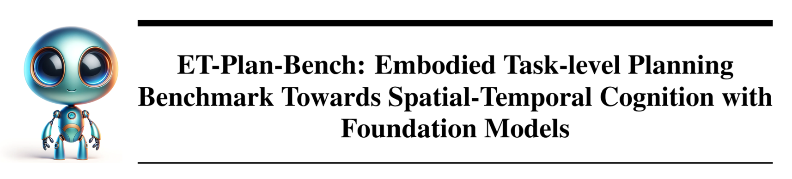
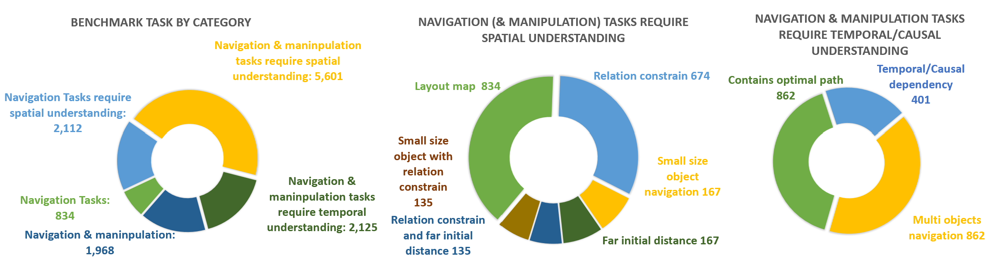
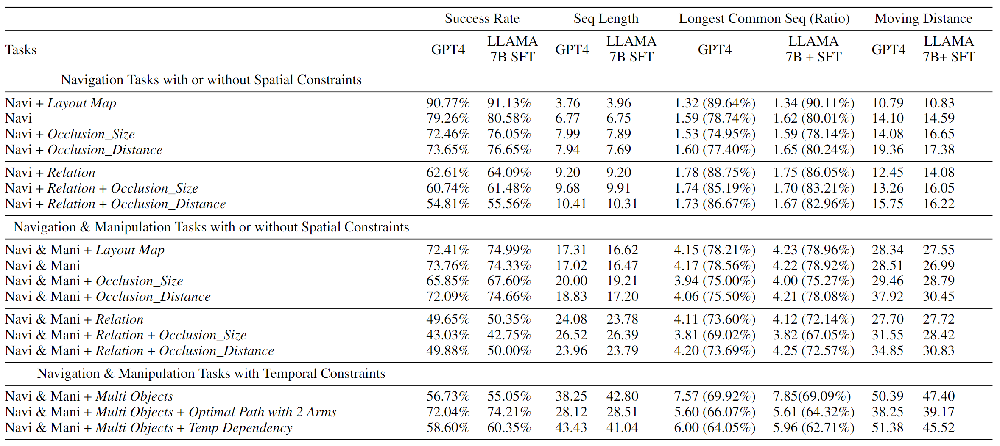

# ET-Plan-Bench

---

Arxiv: https://arxiv.org/abs/2410.14682

## Data Statistics


## Results
Evaluation results on our dataset.


## Installation
To install the VirtualHome v2.3.0 simulator, please refer to https://github.com/xavierpuigf/virtualhome. Feel free to pull the whole github repo inside folder "/simulator"

To supervised fine-tune (SFT) LLM, please refer to https://github.com/haotian-liu/LLaVA. To transfer generated data to the data format for SFT, please refer to https://github.com/haotian-liu/LLaVA/blob/main/docs/Finetune_Custom_Data.md. We utilized the text-only component of LLaVA-1.5, which has been fine-tuned from LLAMA2

All packages required are included in environment.txt.

## Instruction
### Task generation

Please refer to [README](/task_generation_codes/README.md)

### Evaluation
## Navigation tasks with or without spatial constraints

Please refer to [README](/evaluation_generation/navigation_tasks/README.md)

## Navigation and Manipulation (single object) tasks with or without spatial constraints

Please refer to [README](/evaluation_generation/navigation_manipulation_tasks/EmbodiedAI/README.md)

## Navigation and Manipulation (multiple objects) tasks with temporal constraint

Please refer to [README](/evaluation_generation/navigation_manipulation_multiple_objects/README.md)

## 📖 Citation

If you use this project in your research, please cite:

```bibtex
@article{zhang2024plan,
  title={Et-plan-bench: Embodied task-level planning benchmark towards spatial-temporal cognition with foundation models},
  author={Zhang, Lingfeng and Wang, Yuening and Gu, Hongjian and Hamidizadeh, Atia and Zhang, Zhanguang and Liu, Yuecheng and Wang, Yutong and Bravo, David Gamaliel Arcos and Dong, Junyi and Zhou, Shunbo and others},
  journal={arXiv preprint arXiv:2410.14682},
  year={2024}
}
